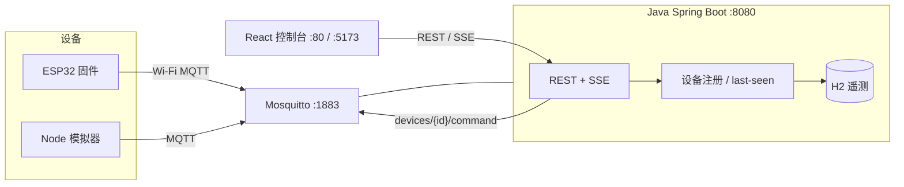

# ESP32 物联控制台

一套可本地跑通的小型设备控制台：ESP32 固件通过 MQTT 上报在线状态与温湿度，Java Spring Boot 负责设备注册、指令下发和遥测存储，React 仪表盘用 REST + SSE 展示实时数据。仓库里带设备模拟器，没有开发板也能演示完整链路。

本仓库面向通用 **ESP32-WROOM-32 DevKit**（拼多多常见白牌开发板，GPIO 2 板载 LED、GPIO 4 接 DHT11）。传感器不是必须的：固件读不到 DHT11 时会使用**明确标注的模拟回退**，控制台仍可工作。

> 后续生产主机计划为 `116.62.158.35`。请先在本机用 Docker / 分服务启动验证；不要对那台机器做 SSH、扫描或未经授权的部署。

## 架构



设计取舍：

- Broker 用 Mosquitto，和真实设备协议一致，不在前端伪造数据。
- 后端订阅 MQTT，设备首次上报即自动入库；LWT + 超时双重判断在线/离线。
- 前端开发时由 Vite 把 `/api` 代理到 Java；Docker 里由 Nginx 反向代理，浏览器只访问一个端口。
- 实时更新用 SSE（`GET /api/events`），LED 开关走 REST，避免再引入一套 WebSocket 协议。

## MQTT 主题

| 主题 | 方向 | 说明 |
| --- | --- | --- |
| `devices/{deviceId}/status` | 设备 → 后端 | 上线/离线，**retain + LWT**。JSON：`{"state":"online","name":"客厅开发板"}`，也接受纯文本 `online` / `offline`。 |
| `devices/{deviceId}/telemetry` | 设备 → 后端 | JSON：`tempC`、`humidity`、`led`、`rssi`、可选 `ts`、`source`（`SENSOR` / `SIMULATED`）。不 retain。 |
| `devices/{deviceId}/command` | 后端 → 设备 | JSON：`{"led":true}` 或 `{"led":false}`。 |

后端订阅过滤器：`devices/+/status`、`devices/+/telemetry`。

## REST

| 方法 | 路径 | 作用 |
| --- | --- | --- |
| `GET` | `/api/health` | 进程健康、MQTT 是否已连、设备计数 |
| `GET` | `/api/devices` | 设备列表（含最近温湿度、LED、在线状态） |
| `GET` | `/api/devices/{id}` | 单台设备 |
| `POST` | `/api/devices/{id}/led` | 体：`{"led":true}`，经 MQTT 下发 |
| `GET` | `/api/devices/{id}/telemetry?limit=60` | 历史遥测，时间正序 |
| `GET` | `/api/events` | SSE：`device` / `telemetry` / `ready` |

默认端口：

| 服务 | 端口 |
| --- | --- |
| 控制台（Docker 里的 Nginx） | `8088` |
| Java 后端 | `8080` |
| Vite 开发服务器 | `5173` |
| Mosquitto | `1883` |

## 一键演示（推荐）

需要本机已安装 Docker 与 Docker Compose。

```bash
docker compose up --build
```

浏览器打开 <http://localhost:8088/> 。Compose 会启动 broker、Java、前端和 **2 台模拟 ESP32**。稍等后端连上 MQTT 后，侧栏会出现「模拟器 01 / 02」，温度湿度持续刷新，点击「板载 LED」可看到灯状态回传。

如果你打开 <http://localhost/> 只看到英文 **Welcome to nginx!**，那是电脑上**另一套**已经占用 80 端口的 Nginx 欢迎页，不是本控制台。本项目没有要求你单独安装 Nginx；Docker 前端镜像里自带一份，只用来发网页。请改用 <http://localhost:8088/> 。

停止：

```bash
docker compose down
```

H2 数据在 `backend-data` 卷里，下次 `up` 仍保留设备历史。

## 本机分服务启动（无 Docker 时）

依赖：JDK 21、Maven 3.8+、Node 20+、Mosquitto。

```bash
# 1) MQTT broker（仓库已提供匿名演示配置）
mosquitto -c mosquitto/mosquitto.conf

# 2) Java 后端
cd backend
mvn spring-boot:run

# 3) 新终端：React
cd frontend
npm install
npm run dev

# 4) 再开一个终端：设备模拟器
cd simulator
npm install
npm start
```

然后打开 <http://localhost:5173/> 。Vite 会把 `/api` 代理到 `http://127.0.0.1:8080`。

只跑测试与构建：

```bash
cd backend && mvn test
cd frontend && npm install && npm run build
```

## 设备模拟器

模拟器发布的主题、JSON 字段与固件相同，可当作没有硬件时的 ESP32。

```bash
cd simulator
npm install
MQTT_HOST=localhost MQTT_PORT=1883 DEVICE_COUNT=2 npm start
```

常用环境变量：

| 变量 | 默认 | 含义 |
| --- | --- | --- |
| `MQTT_HOST` | `localhost` | Broker 地址 |
| `MQTT_PORT` | `1883` | Broker 端口 |
| `DEVICE_COUNT` | `2` | 自动生成 `esp32-sim-01`… |
| `DEVICE_IDS` | （空） | 逗号分隔，覆盖自动 ID |
| `DEVICE_NAMES` | 模拟器 01… | 中文显示名 |
| `INTERVAL_MS` | `4000` | 遥测周期 |
| `MQTT_USERNAME` / `MQTT_PASSWORD` | （空） | 若 broker 开启认证 |

## 烧录 ESP32

目标板：常见 **ESP32-WROOM-32 DevKit**（Arduino 板型选 `ESP32 Dev Module`）。

引脚：

- 板载 LED：`GPIO 2`
- DHT11 DATA：`GPIO 4`（VCC 3V3，GND 接地）。没有传感器也可以烧，固件会走模拟回退，遥测 `source=SIMULATED`。

### 准备密钥（不要提交）

```bash
cp firmware/include/secrets.example.h firmware/include/secrets.h
```

编辑 `firmware/include/secrets.h`：

```c
#define WIFI_SSID "家里的WiFi"
#define WIFI_PASSWORD "wifi密码"
#define MQTT_HOST "192.168.1.8"   // 跑 Mosquitto 的电脑局域网 IP
#define MQTT_PORT 1883
#define DEVICE_ID "esp32-devkit-01"
#define DEVICE_NAME "书桌开发板"
```

以后若把 broker 放到 `116.62.158.35`，把 `MQTT_HOST` 改成该地址即可。`secrets.h` 已被 gitignore。

### PlatformIO

```bash
# 安装 PlatformIO Core 后
cd firmware
pio run                 # 编译
pio run -t upload       # 烧录（按住 BOOT，必要时再按 EN）
pio device monitor      # 115200 观察 Wi-Fi / MQTT 日志
```

`platformio.ini` 已按 `esp32dev` + Arduino 框架配置，并拉取 PubSubClient、ArduinoJson、DHT。

### Arduino IDE

1. 安装 Arduino IDE 2，在开发板管理器添加 ESP32，选 **ESP32 Dev Module**。
2. 库管理器安装：`PubSubClient`、`ArduinoJson`（v7）、`DHT sensor library`、`Adafruit Unified Sensor`。
3. 新建草图，把 `firmware/src/main.cpp` 内容粘贴进去；把 `firmware/include/secrets.h` 放到草图目录并 `#include "secrets.h"`。
4. 上传，串口监视器 115200。

烧录成功且能访问 broker 后，控制台会自动出现该 `DEVICE_ID`，无需在 Java 里手工注册。

## 环境变量（后端）

| 变量 | 默认 | 含义 |
| --- | --- | --- |
| `SERVER_PORT` | `8080` | HTTP 端口 |
| `MQTT_HOST` | `localhost` | Broker 主机。Compose 里是 `mosquitto` |
| `MQTT_PORT` | `1883` | Broker 端口 |
| `MQTT_CLIENT_ID` | `iot-console-backend` | 后端 MQTT 客户端 ID |
| `MQTT_USERNAME` / `MQTT_PASSWORD` | 空 | 可选认证 |
| `MQTT_AUTO_CONNECT` | `true` | 测试时可关 |
| `H2_PATH` | `./data/iot` | H2 文件路径 |
| `CORS_ORIGINS` | `http://localhost:5173,...` | 允许的前端源 |
| `TELEMETRY_HISTORY_LIMIT` | `200` | 每台设备保留的采样数 |
| `DEVICE_STALE_AFTER_SECONDS` | `30` | 超时未心跳则标离线 |

匿名 MQTT 仅供演示。上公网前应给 Mosquitto 加账号密码，并同步设置固件 / 模拟器 / 后端的 `MQTT_USERNAME` 与 `MQTT_PASSWORD`。

## 指向 116.62.158.35（仅文档，不要在未授权时操作）

在那台已归你管理的主机上，预期部署方式：

1. 安装 Docker，把本仓库放到服务器，执行 `docker compose up -d --build`。
2. 安全组 / 防火墙开放：
   - `80`：浏览器打开控制台 `http://116.62.158.35/`
   - `1883`：ESP32 / 模拟器连 MQTT（生产环境务必加认证，或只对可信网段开放）
   - `8080` 可以不映射到公网，让 Nginx 只反代 `/api`
3. 固件 `secrets.h`：

```c
#define MQTT_HOST "116.62.158.35"
#define MQTT_PORT 1883
```

4. 设备需能解析并访问该 IP 的 1883；家里路由器不用做端口映射到 ESP32，只要 ESP32 能出网即可。
5. 若前端仍用 Vite 直连 Java，把 `CORS_ORIGINS` 加上实际访问源。

本仓库不会、也不应当去连接、扫描或登录 `116.62.158.35`。

## Windows 常见问题

**打开 localhost 出现 Welcome to nginx!**  
你多半没有为这个项目单独装过 Nginx。Docker 前端镜像里自带 Nginx，只负责把网页发出去。`localhost:80` 上那份欢迎页通常是电脑里以前就有的 Nginx / 宝塔 / phpstudy / 其它容器。本控制台在 Docker 下请用 <http://localhost:8088/> 。

先确认容器都起来了：

```bash
docker compose ps
```

再试采集端是否活着：<http://localhost:8080/api/health> 应返回 `"status":"UP"`。

## 目录

```
firmware/     ESP32 PlatformIO / Arduino 固件
backend/      Spring Boot 3 + H2 + Eclipse Paho
frontend/     React + Vite + TypeScript
simulator/    与固件同协议的 Node MQTT 模拟器
mosquitto/    演示用 broker 配置
docker-compose.yml
```

## 许可与安全

演示栈默认匿名 MQTT、H2 本地文件、无登录墙，只适合实验室或内网。不要把真实 Wi-Fi 密码提交到 Git。
